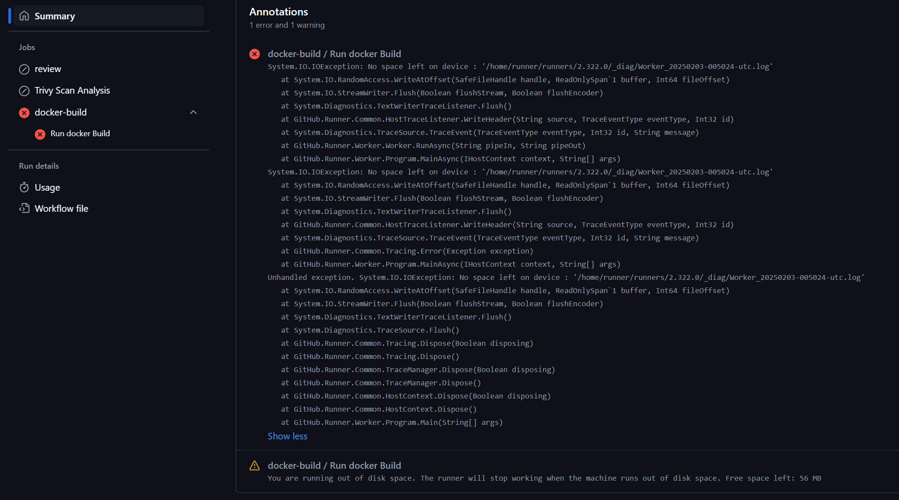

# Stable Diffusion AI Model Deployment with Docker

This repository provides a Docker setup for deploying the Stable Diffusion AI model. The Docker image uses the official NVIDIA PyTorch container as a base and includes all necessary dependencies for running the Stable Diffusion WebUI and model. This repository provides a quick and easy way to set up [Open WebUI](https://github.com/open-webui/open-webui) with all the additional features.

## Requirements

- Docker installed on your system
- NVIDIA GPU with CUDA support (GPU is optional if you want to use CPU mode)

Currently, this setup is optimized for NVIDIA hardware, but I plan to add AMD configurations as well. For instructions on setting up the NVIDIA SDK, refer to [this tutorial](https://www.containerssimplified.com/container/running-ollama-on-your-local-machine-with-nvidia-gpus/).

## Details

The Dockerfile used in this repository sets up an environment with Python 3.10, necessary dependencies, PyTorch with CUDA support, and clones the required repositories (Stable Diffusion WebUI and Stable Diffusion). The working directory is set to `/usr/src`, and the command to start the WebUI with NVIDIA GPU acceleration and skip torch CUDA test is specified in the ENTRYPOINT.

The docker-compose file allows for easy management of multiple services, including the Stable Diffusion WebUI, model service, and necessary volumes for storing data.

## Switching profiles

The docker compose file is set to handle 3 profiles:
- default (no gpu pods)
- NVIDIA
- AMD

Specify the --profile to ensure the appropriate pods start:
```
docker compose --profile default up -d
```

to spool down
```
docker compose --profile default down
```

## Updating the Repository

If updates to the repositories are made, you can rebuild the Docker image by running:
```
docker build -t stable-diffusion .
```

If you want to enable added models and/or extensions, use the following:
```
docker build --build-arg addmodels=true --build-arg addextensions=false -t stable-diffusion .
```
OR
```
docker buildx bake
```

### About the Dockerfile
The `stable-diffusion/AUTOMATIC1111` is quite large, and I suspect the limitations around image size are why I can't find any of the old docker images I use to use. To address this issue, I have created a Docker image based on a recent CUDA base image. Building this image may take several minutes (5+ minutes).

### Only stable-diffusion

1. Build the Docker image by running the following command in a terminal:
   ```
   docker build -t stable-diffusion .
   ```

2. Run the container with the following command:
   ```
   docker run --gpus all -p 7860:7860 -d stable-diffusion
   ```
   If you don't have a GPU, use the following command instead:
   ```
   docker run -p 7860:7860 -d stable-diffusion
   ```

3. Open your web browser and visit `http://localhost:7860` to access the Stable Diffusion WebUI.

## Example usage
1. Rename `example.env` and `exampledocker-compose.yaml` files and drop `example` from the name 

2. Run the following command
```bash
docker-compose --profile default up -d
```

This will create a folder called `openweb-complete` in your user directory and the required subfolders for each application. Feel free to customize this setup according to your preferences. The `docker-compose` file contains the hardcoded port numbers that the Docker images use, allowing you to map them as needed locally.

**Note:** If you just restarted ollama, it may take some time for the first model load before it starts responding. The first message always takes a while.

## Troubleshooting

- If you encounter any issues with the Docker setup, please make sure that you have installed Docker correctly and have the necessary GPU support (if using a GPU). You may also want to check the [Docker documentation](https://docs.docker.com/engine/install/) for help troubleshooting Docker-related problems.

## Image sizes
The images used in this setup are large, so keep that in mind:
- ollama: 4.91GB
- open-webui: 5.91GB
- stable-diffusion: 31.11GB

Be prepared for your system to require a significant amount of free disk space and for your video card to experience strain during operation.

## Flow


## Contributing

Contributions are always welcome! If you would like to contribute, please fork this repository, make your changes, and submit a pull request.

## What still needs to be done:
- [ ] Update openweb for STT (right now its usuing built in whisper)
- [ ] Allow model preload SD
- [ ] Allow model preload Ollama
- [ ] Research Gen Video models
- [X] Update openweb for TTS
- [X] Wire TTS to openwebui
- [X] Update openweb for image generation (outputs are screwed up)
- [X] pass openweb default image params that match SD
- [X] test docker bake file... this kinda only works locally... github pipelines run out of space: 
